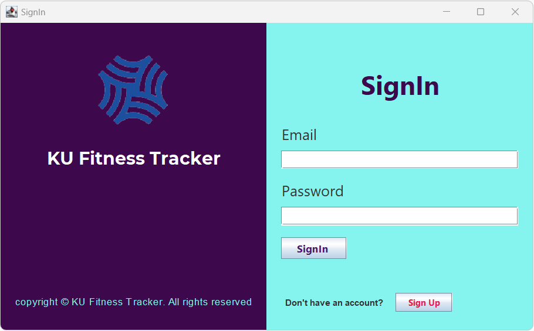
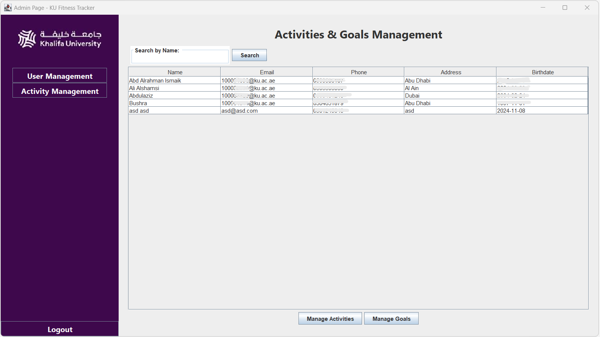
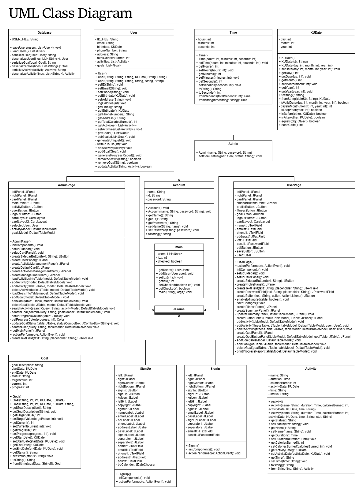

**Overview**

The Khalifa University Fitness Tracker is a Java-based application designed to help users track their fitness activities, set goals, and monitor progress. The app also allows administrators to manage user accounts and approve goals. It uses Object-Oriented Programming (OOP) principles and features a simple, user-friendly Graphical User Interface (GUI).

**Features**

Users:
 - Create and manage accounts.
 - Log fitness activities (e.g., running, cycling) and track progress.
 - Set and monitor fitness goals.
 - Generate exportable progress reports.

Admins:
 - Manage user accounts and activities.
 - Approve or reject fitness goals.
 - View and search user activity data.

**Technologies Used**

 - Java: Main programming language.
 - Java Swing/JavaFX: For building the GUI.
 - File I/O: For storing and retrieving data.

